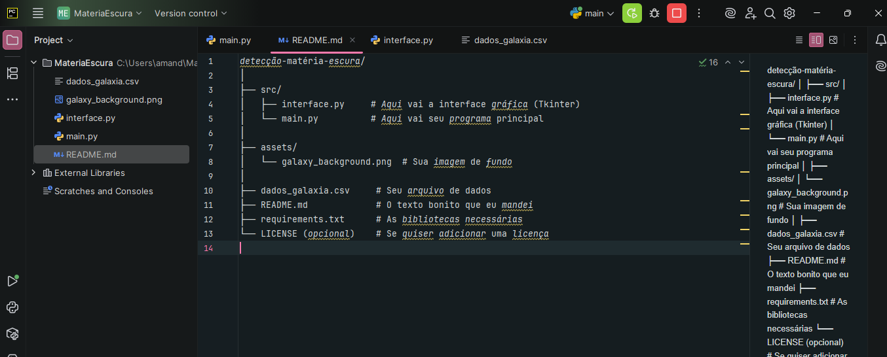

detecção-matéria-escura/
│
├── src/
│   ├── interface.py     
<<<<<<< HEAD
│   └── main.py         
│
├── assets/
│   └── galaxy_background.png  
│
├── dados_galaxia.csv     
├── README.md            
├── requirements.txt      
└── LICENSE (opcional)    

=======
│   └── main.py          
│
├── assets/
│   └── galaxy_background.png  
├── dados_galaxia.csv    
├── README.md             
├── requirements.txt     
└── LICENSE (opcional)    

>>>>>>> 97b77e62e9dd0e32952c1c034efff35f7d477b9b
